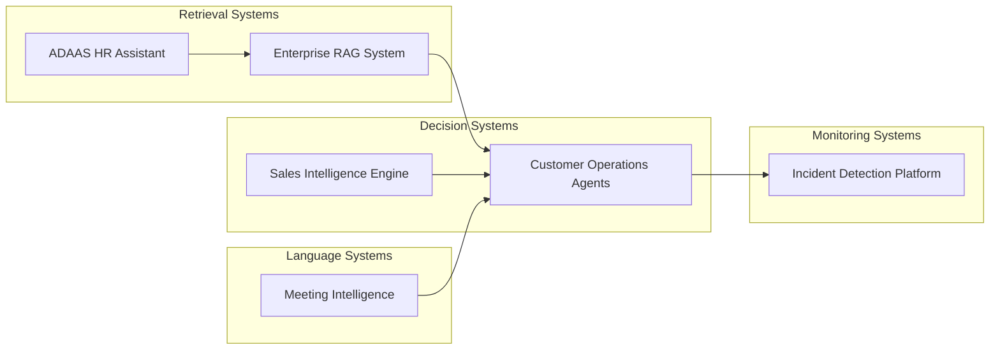

# Adityansh Chand's AI Software Engineering Portfolio

A collection of production-style AI systems made by Adityansh Chand demonstrating real-world architecture patterns used in modern machine learning and AI platforms.

This portfolio focuses on applied system design rather than isolated models, showing how AI components integrate into scalable software systems.

---

# Systems Overview

| System | Category | Repository |
|--------|----------|-----------|
| enterprise-rag-knowledge-system | Retrieval Engineering | https://github.com/Adityansh-Chand/enterprise-rag-knowledge-system |
| ai-proactive-customer-operations | Multi-Agent Systems | https://github.com/Adityansh-Chand/ai-proactive-customer-operations |
| ai-incident-detection-platform | ML Monitoring | https://github.com/Adityansh-Chand/ai-incident-detection-platform |
| ai-sales-intelligence-engine | Predictive ML | https://github.com/Adityansh-Chand/ai-sales-intelligence-engine |
| autonomous-meeting-intelligence | LLM Processing | https://github.com/Adityansh-Chand/autonomous-meeting-intelligence |
| ADAAS | Production RAG Application | https://github.com/Adityansh-Chand/ADAAS |

---

# Portfolio Architecture Map

---

# Projects

  
## 1. enterprise-rag-knowledge-system
https://github.com/Adityansh-Chand/enterprise-rag-knowledge-system

Production Retrieval-Augmented Generation system demonstrating hybrid retrieval, semantic chunking, reranking, and evaluation-aware pipeline design.

Key engineering signals:

- semantic chunking
- hybrid vector + keyword retrieval
- confidence scoring
- evaluation metrics
- modular embedding layer
- structured outputs

---

## 2. ai-proactive-customer-operations
https://github.com/Adityansh-Chand/ai-proactive-customer-operations

Multi-agent orchestration system modeling enterprise decision workflows for proactive customer experience automation.

Key engineering signals:

- agent routing logic
- reasoning engine
- policy decision layer
- orchestration pipeline

---

## 3. ai-incident-detection-platform
https://github.com/Adityansh-Chand/ai-incident-detection-platform

Machine learning pipeline for anomaly detection in operational logs using structured feature extraction and scoring abstractions.

Key engineering signals:

- feature pipeline design
- anomaly scoring abstraction
- monitoring architecture

---

## 4. ai-sales-intelligence-engine
https://github.com/Adityansh-Chand/ai-sales-intelligence-engine

Predictive ML pipeline modeling customer scoring and revenue intelligence workflows.

Key engineering signals:

- feature engineering layer
- scoring model abstraction
- prediction pipeline structure

---

## 5. autonomous-meeting-intelligence
https://github.com/Adityansh-Chand/autonomous-meeting-intelligence

LLM-powered transcript understanding system for extracting structured insights from conversational data.

Key engineering signals:

- transcript chunking pipeline
- structured extraction logic
- summarization architecture

---

## 6. ADAAS
https://github.com/Adityansh-Chand/ADAAS

Mobile-first HR AI assistant integrating Retrieval-Augmented Generation with real-time employee database queries.

Key engineering signals:

- hybrid RAG + API routing
- intent classification logic
- structured UI rendering
- real-time database integration

---

# Common Engineering Themes

Across all projects:

- modular architecture
- evaluation-aware development
- reproducible pipelines
- observable reasoning outputs
- separation of concerns
- extensible component design

---

# Technology Areas Demonstrated

Machine Learning Engineering  
Retrieval-Augmented Generation (RAG)  
Multi-Agent Systems  
LLM Workflow Design  
Feature Engineering Pipelines  
AI System Architecture  

---

# Author

**Adityansh Chand**  
AI Software Engineer

Specializing in designing production-style AI systems combining:

• Retrieval-Augmented Generation (RAG)
• Multi-agent decision systems
• Machine learning pipelines
• LLM-powered automation workflows
• scalable AI architecture patterns

GitHub: https://github.com/Adityansh-Chand
Linkedin: https://www.linkedin.com/in/adityansh-chand-b517a1296/
