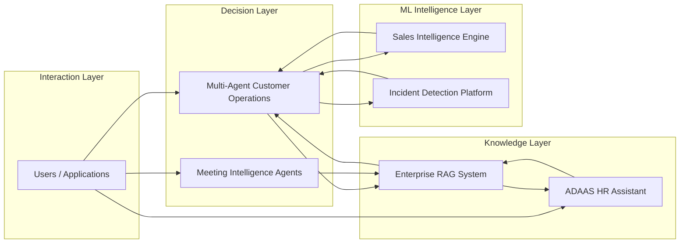
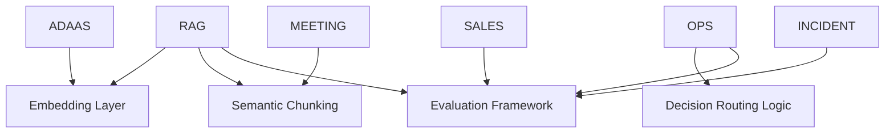

# AI Systems Engineering Portfolio

Production-style AI platform demonstrating multi-agent workflows, Retrieval-Augmented Generation (RAG), and machine learning pipelines.

---

# Unified AI Platform Architecture

---

# Shared Component Dependencies

---

# Systems

## 1. enterprise-rag-knowledge-system
Core retrieval reasoning backbone using semantic chunking, reranking, and confidence scoring.

## 2. ai-proactive-customer-operations
Explicit multi-agent DAG orchestration implementing planner → specialist → action workflow.

## 3. ADAAS
Production HR assistant integrating RAG reasoning with real-time API data.

## 4. ai-sales-intelligence-engine
Predictive ML pipeline for customer intelligence scoring.

## 5. ai-incident-detection-platform
Anomaly detection system for operational intelligence.

## 6. autonomous-meeting-intelligence
LLM-powered structured transcript understanding pipeline.

---

# Architectural Themes

• multi-agent orchestration
• DAG reasoning graphs
• retrieval engineering
• modular ML pipelines
• evaluation-aware design
• observable decision logic

---

# Author

Adityansh Chand

AI Software Engineer specializing in:

multi-agent systems
retrieval engineering
LLM architecture
machine learning pipelines
